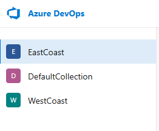

# CxOneFlow Audit Tool

This tool can be used to audit, configured, and de-configure CxOneFlow event web hooks in an SCM.

This currently only works with Azure DevOps Cloud and Enterprise.

## Installation

Python 3.9+ is required to install and execute `cxoneflow-audit`.  Installation can be performed using `pip` to download
and install the Python package with a command similar to the following:

```
pip install https://github.com/checkmarx-ts/cxone-flow-audit/releases/download/X.X.X/cxoneflow_audit-X.X.X-py3-none-any.whl
```

Please visit the [GitHub Releases](https://github.com/checkmarx-ts/cxone-flow-audit/releases)
to obtain the URL of the latest release binary.


## Executing

There are 3 functions that can be performed by `cxoneflow-audit`:

* Audit: This creates a CSV file showing configuration status for CxOneFlow webhooks.
* Deploy: (Coming soon) Deploys required configurations for CxOneFlow webhooks.
* Remove: (Coming soon) Removes deployed configurations for CxOneFlow webhooks.

After installation, executing the command `cxoneflow-audit -h` will show detailed help.


### General Configuration Options

The general options are used for all operations.

#### Informational Options
|Option|Description|
|-|-|
|`-h` or `--help`|Show detailed help and exit.|
|`-v` or `--version`|Show the `cxoneflow-audit` release version and exit.|


#### Logging Options

|Option|Optional|Description|
|-|-|-|
|`--level LOGLEVEL`|Y|Logging output level, defaults to `INFO`.<br>Can be set to: `DEBUG`, `INFO`, `WARNING`, `ERROR`, or `CRITICAL`|
|`--log-file LOGFILE`|Y|A file where logs are written in addition to displaying logs on the console.|
|`-q`|Y|Do not output logs on the console.|

#### Runtime and Networking Options

|Option|Optional|Description|
|-|-|-|
|`-t THREADS`|Y| The number of concurrent SCM read/write operations. [default: 4]|
|`-k`|Y|Ignore SSL verification failures.|
|`--proxy PROXY_URL`|Y|A proxy server to use for communication.|

#### Filtering Options

These options are mutually exclusive.

|Option|Optional|Description|
|-|-|-|
|`--match-regex M_REGEX`|Y|Regular expression that matches projects/orgs that should be configured to send events to CxOneFlow.|
|`--skip-regex S_REGEX`|Y|Regular expression that matches projects/orgs that *should not* be configured to send events to CxOneFlow.|

#### CxOneFlow Endpoint Options

|Option|Optional|Description|
|-|-|-|
|`--cx-url CX_URL`|N| The base URL for the CxOneFlow endpoint (e.g. https://cxoneflow.corp.com)|

#### SCM Options

|Option|Optional|Description|
|-|-|-|
|`--pat PAT`|N|An SCM PAT with appropriate privileges to execute the selected `cxoneflow-audit` function.|
|`--pat-env`|N|Obtain the PAT from the environment variable `CX_PAT` instead of providing it on the command line with `--pat`.|
|`--scm-url URL`|N|The URL to the SCM instance.|

SCM URL Examples:                             
* ADO Cloud: https://dev.azure.com
* ADO Enterprise: https://ado.corp.com


### Audit (`--audit`)

When the `--audit` parameter is selected, a CSV of configured web hooks
for the SCM is generated.  The configuration is performed at the "organization" level
(with the concept of "organization" varying by SCM) so the audit will not
show web hook configurations set on individual repositories.

Parameters that can be used with `--audit`:

|Parameter|Optional|Description|
|-|-|-|
| `--outfile CSVFILE` |Y|If provided, sets the path to the CSV file created.  Default: ./cxoneflow.csv |
| `--no-config` |Y|The output of the CSV will contain only those organizations that are not configured or are partially configured.|

### Deploy (`--deploy`)

When executing

|Option|Optional|Description|
|-|-|-|
|`--cx-url CX_URL`|N| The base URL for the CxOneFlow endpoint (e.g. https://cxoneflow.corp.com)|
|`--shared-secret SECRET`|See Note|The shared secret configured in the service hook.
|`--shared-secret-env`|See Note|Obtain the shared secret from the environment variable `CX_SECRET`

Note: One of `--shared-secret` or `--shared-secret-env` is required when using the `--deploy`
function.

### Azure DevOps (`ado`)

The option `ado TARGETS...` indicates the operation is performed against an Azure DevOps
cloud or enterprise instance.  The `TARGETS...` are one or more collections
found at the instance URL.  (e.g. `DefaultCollection`, `Corp`, etc).

## SCM Specific Information

### Azure DevOps

The minimum permissions provided by a PAT for each function are:

|Function|Permissions|
|-|-|
|`--audit`| `Build::Read`, `Code::Read`, `Project and Team::Read`, `Service Connections::Read & Query`
|`--deploy`|TBD|
|`--remove`|TBD|

#### Audit Example

Assume there is an Azure DevOps Enterprise instance located at `https://ado.corp.com`
with the following collections defined:



An example command line to perform the audit function would be similar to:

```
cxoneflow-audit --cx-url https://cxoneflow.corp.com \
  --pat <your PAT> \
  --scm-url https://ado.corp.com \
  ado DefaultCollection EastCoast WestCoast
```

The default output file `./cxoneflow.csv` would be generated containing the
webhook configuration disposition for all projects found in collections
**DefaultCollection**, **EastCoast**, and **WestCoast**.

A similar example that limits the audit to projects found in the specified collections
that begin with either "New York" or "Los Angeles":

```
cxoneflow-audit --cx-url https://cxoneflow.corp.com \
  --pat <your PAT> \
  --scm-url https://ado.corp.com \
  --match-regex '^New.York|^Los.Angeles' \
  ado DefaultCollection EastCoast WestCoast
```

Note the single-quotes surrounding the regular expression.

This example is similar but will only audit projects that
*do not* begin with "New York" or "Los Angeles":

```
cxoneflow-audit --cx-url https://cxoneflow.corp.com \
  --pat <your PAT> \
  --scm-url https://ado.corp.com \
  --skip-regex '^New.York|^Los.Angeles' \
  ado DefaultCollection EastCoast WestCoast
```

#### Deployment Example

TBD

#### Remove Example

TBD
