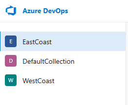

# CxOneFlow Audit Tool

This is a command line tool that can be used to audit, configure, and de-configure [CxOneFlow](https://github.com/checkmarx-ts/cxone-flow) event web hooks in an SCM.

This currently supports the following SCM types:

* Azure DevOps Cloud and Enterprise
* Github Cloud and Enterprise (self-hosted)

## Installation

Python 3.9+ is required to install and execute `cxoneflow-audit`.  Installation can be performed using `pip` to download
and install the Python package with a command similar to the following:

```
pip install https://github.com/checkmarx-ts/cxone-flow-audit/releases/download/X.X.X/cxoneflow_audit-X.X.X-py3-none-any.whl
```

Please visit the [Github Releases](https://github.com/checkmarx-ts/cxone-flow-audit/releases)
to obtain the URL of the latest release binary.

## Operations

`cxoneflow-audit` can perform the following functions for the supported SCMs:

* Audit: This creates a CSV file showing configuration status for [CxOneFlow](https://github.com/checkmarx-ts/cxone-flow) integration configurations.
* Deploy: Deploys required configurations for [CxOneFlow](https://github.com/checkmarx-ts/cxone-flow) webhooks.
* Remove: Removes deployed configurations for [CxOneFlow](https://github.com/checkmarx-ts/cxone-flow) integration configurations.
* Kickoff: Iterates through repositories, invokes an initial scan of the default branch via [CxOneFlow](https://github.com/checkmarx-ts/cxone-flow).

The functions work with each SCM differently depending on repository toplogy and integration options.

### Kickoff

Before attempting to execute `cxoneflow-audit` using the kickoff function, it is recommended that
CxOneFlow be fully configured and tested to successfully handle webhook events from the
repositories to be scanned.  This will ensure that a service definition is available to
execute the scan upon receipt of the kickoff request.

To execute the `cxoneflow-audit` kickoff scans, it is required that an SSH public/private key pair is generated.  The
CxOneFlow endpoint is then configured to use the public key to identify the kickoff scan request originator.
The public key must be provided to the CxOneFlow endpoint administrator to configure the CxOneFlow endpoint.  

The most compatible way to generate an SSH public/private key pair is to execute the command `ssh-keygen -t ed25519`
and follow the prompts. Please refer to the CxOneFlow manual for further information about generating an
SSH public/private key pair using `ssh-keygen`.

Unlike the other functions, the kickoff function can take a significant amount of time to execute.  
The kickoff can be stopped and re-started without duplicating scans.

The [CxOneFlow](https://github.com/checkmarx-ts/cxone-flow) endpoint can be configured for a maximum of 10
concurrent kickoff scans.  The number of concurrent kickoff scans must be throttled to avoid
consuming all concurrent scan capacity. If the server indicates there are too many concurrent scans running,
the `cxoneflow-audit` execution will pause until the server accepts another scan.  When all repositories
have had at least one scan submitted, `cxoneflow-audit` will exit.  An audit CSV file is written to record
errors or scan ids that were associated with each repository.

Not all repositories will be scanned at the time of the kickoff scan request.  If a repository
in a kickoff scan request is matched to a CheckmarxOne project that has at least one scan
on any branch, no scan is performed.  As repositories are iterated, scans are skipped if the
server's duplicate detecting logic determines no scan is required.  


## Execution

After installation, executing the command `cxoneflow-audit -h` will show detailed help:

```
Usage: cxoneflow-audit [--level LOGLEVEL] [--log-file LOGFILE] [-qk] [-t THREADS] [--proxy PROXY_URL] <scm> [<args>...]

  <scm> can be one of:
  adoe                Commands for Azure DevOps
  gh                  Commands for Github
  gl                  Commands for Gitlab
  bbdc                Commands for BitBucket Data Center

  Use "cxoneflow-audit help <scm>" for help details for each SCM.

  Runtime Information

  -h,--help           Use this parameter to show help for any command.

  -v,--version        Show version and exit.


  Logging Options

  --level LOGLEVEL    Log level [default: INFO]
                      Use: DEBUG, INFO, WARNING, ERROR, CRITICAL

  --log-file LOGFILE  A file where logs are written.

  -q                  Do not output logs to the console.


  Runtime Options

  -t THREADS         The number of concurrent SCM read/write operations. [Default: 4]

  -k                 Ignore SSL verification failures. [Default: False]

  --proxy PROXY_URL  A proxy server to use for communication.

```

The general options should be set before selecting the SCM to
be used to execute the auditing function.  Help for execution of each
function for a specific SCM can be displayed with the
`cxoneflow-audit help <scm>` command.

Each SCM supports the commands `audit`, `deploy`, `remove`, and `kickoff`.  As an example, the command "`cxoneflow-audit help adoe`"
shows that further help is available with the command "`cxoneflow-audit help <scm> <command>`":

```
Usage: cxoneflow-audit adoe <command> [<args>...]

    <command> can be one of:
    audit       Execute an audit for CxOneFlow webhook deployment.

    deploy      Deploy CxOneFlow webhooks on the projects in the specified collections.

    remove      Remove CxOneFlow webhooks on the projects in the specified collections.

    kickoff     Iterate through project repositories in the specified collection
                and perform an initial scan on the default branch.

    Use "cxoneflow-audit help adoe <command>" for further help.
```

## Audit Function

The audit function produces a CSV showing the configuration
state of each logical configuration unit of your SCM.  The
"logical configuration unit" or LU definition varys by SCM type.

### Azure DevOps

Service hooks are deployed on each project in Azure DevOps.  The audit function
will show the configuration status of each project in each collection
provided in the `TARGETS...` parameter.

Display the Azure DevOps `audit` help with the command `cxoneflow-audit help adoe audit`.

### Github

Github can be configured to use webhooks configured at the organization level or a Github app
installed in the organization.  The audit function will validate that the webhooks or the Github
app is deployed and configured correctly.

Github's security requires a PAT generated by an account that has organization
ownership to be able to validate if an organization is properly configured.  If a PAT from a user that
is only an organization member is used, the organization will likely be reported as not
configured.

The PAT from an organization owner must also have the following permissions:

* `admin:org_hook`
* `admin:org:read:org`

The audit function can be given a slug for the Github app (the slug is the last path element
of the "Public Link" displayed in the app's "About" section) to validate the app is installed.
To validate the app is correctly configured for the organization, a private key for the app is required.
If a private key is not provided, the app installation can be validated but the configuration
of the app can't be validated.

Display the Github `audit` help with the command `cxoneflow-audit help gh audit`.

## Deploy Function

### Azure DevOps

The deploy function will create service hooks on each project found in
each collection provided in the `TARGETS...` parameter.

Display the Azure DevOps `deploy` help with the command `cxoneflow-audit help adoe deploy`.


### Github

The deploy function for Github will install webhook configurations at the organization level only.
It will not attempt to install a Github app into an organization; installation of the app into organizations
is done via the Github app configuration UI.  Deployment of webhook configurations requires a PAT that is
an organization owner as well as having the following permissions:

* `admin:org_hook`
* `admin:org:read:org`

If a slug for a Github app is provided and the app is found to be installed in the organization,
webhook configurations will not be deployed.  It is considered a misconfiguration to have both
the webhooks and Github app configured to emit events.

Display the Github `deploy` help with the command `cxoneflow-audit help gh deploy`.

## Remove Function

### Azure DevOps

The remove function will remove service hooks on each project found in
each collection provided in the `TARGETS...` parameter.

Display the Azure DevOps `remove` help with the command `cxoneflow-audit help adoe remove`.


### Github

The remove function will remove the organization webhooks from each organization.  If a Github app
slug is provided, the app will also be removed from each organization.

Removing these configurations requires a PAT that is an organization owner as well as having the
following permissions:

* `admin:org_hook`
* `admin:org:read:org`


Display the Github `remove` help with the command `cxoneflow-audit help gh remove`.

## Kickoff Function

### Azure DevOps

The kickoff function will iterate repositories in each project found in
each collection provided in the `TARGETS...` parameter.  A scan
of the repository contents at the HEAD of the default branch will be
performed if a scan for the repository does not already exist.

Display the Azure DevOps `kickoff` help with the command `cxoneflow-audit help adoe kickoff`.

### Github

The kickoff function iterates and scans all repositories in each organization visible to the PAT. When not using a Github
app, the PAT needs to be a member of each organization with the `repo:*` permissions set.

If CxOneFlow is configured to use a Github app, the PAT must be from an org owner with permissions `admin:org:read:org` in
addition to `repo:*` permissions.  This is required to read the installation configuration for the organization's installed
instance of the Github app.  If the app installation configuration can't be determined due to PAT permissions, scans
for that organization may fail to start.

Display the Github `kickoff` help with the command `cxoneflow-audit help gh kickoff`.

## SCM Specific Information

### Azure DevOps

Modifying and reading service hook settings is an administrative function.  The user that owns the PAT
for executing the `audit`, `deploy`, and `remove` functions must be in the
`Project Collection Administrators` group.

The PAT used for the `kickoff` function should be from
a user that has the ability to read all repositories.  The privilege requirements for the PAT
used by the CxOneFlow endpoint will be identical to the privileges needed to perform
the kickoff scans.  It is not recommended to use the same PAT as is used by the CxOneFlow
endpoint when executing the kickoff function with `cxoneflow-audit`.

The PAT used when invoking `cxoneflow-audit` for service hook deployments/updates must have these minimum permissions:

* Build::Read
* Code::Read
* Project and Team::Read
* Service Connections::Read & Query

For the following examples, assume there is an Azure DevOps Enterprise instance located at `https://ado.corp.com`
with the following collections defined:



#### Audit Example

An example command line to perform the audit function would be similar to:

```
cxoneflow-audit adoe audit --cx-url https://cxoneflow.corp.com \
  --pat <your PAT> \
  --scm-url https://ado.corp.com \
  DefaultCollection EastCoast WestCoast
```

The default output file `./cxoneflow.csv` would be generated containing the
webhook configuration disposition for all projects found in collections
**DefaultCollection**, **EastCoast**, and **WestCoast**.

A similar example that limits the audit to projects found in the specified collections
that begin with either "New York" or "Los Angeles":

```
cxoneflow-audit adoe audit --cx-url https://cxoneflow.corp.com \
  --pat <your PAT> \
  --scm-url https://ado.corp.com \
  --match-regex '^New.York|^Los.Angeles' \
  DefaultCollection EastCoast WestCoast
```

Note the single-quotes surrounding the regular expression.

This example is similar but will only audit projects that
*do not* begin with "New York" or "Los Angeles":

```
cxoneflow-audit adoe audit --cx-url https://cxoneflow.corp.com \
  --pat <your PAT> \
  --scm-url https://ado.corp.com \
  --skip-regex '^New.York|^Los.Angeles' \
  DefaultCollection EastCoast WestCoast
```

#### Deployment Example

To deploy service hook configurations that point to the [CxOneFlow](https://github.com/checkmarx-ts/cxone-flow) endpoint `https://cxoneflow.corp.com` in **all** projects under the target collections, 
the command line would be similar to the following example:

```
cxoneflow-audit adoe deploy --cx-url https://cxoneflow.corp.com \
  --pat <your PAT> \
  --scm-url https://ado.corp.com \
  --shared-secret <secret> \
  DefaultCollection EastCoast WestCoast
```

In the below example, the service hooks would be deployed only to projects
beginning with "New York" or "Los Angeles":

```
cxoneflow-audit adoe deploy --cx-url https://cxoneflow.corp.com \
  --pat <your PAT> \
  --scm-url https://ado.corp.com \
  --match-regex '^New.York|^Los.Angeles' \
  --shared-secret <secret> \
  DefaultCollection EastCoast WestCoast
```

Note the single-quotes surrounding the regular expression.

The example below is similar but will only deploy service hooks to projects that
*do not* begin with "New York" or "Los Angeles":

```
cxoneflow-audit adoe audit --cx-url https://cxoneflow.corp.com \
  --pat <your PAT> \
  --scm-url https://ado.corp.com \
  --skip-regex '^New.York|^Los.Angeles' \
  --shared-secret <secret> \
  DefaultCollection EastCoast WestCoast
```

#### Remove Example

To remove **all** service hook configurations that point to the [CxOneFlow](https://github.com/checkmarx-ts/cxone-flow) endpoint `https://cxoneflow.corp.com`,
the command line would be similar to the following example:

```
cxoneflow-audit adoe remove --cx-url https://cxoneflow.corp.com \
  --pat <your PAT> \
  --scm-url https://ado.corp.com \
  DefaultCollection EastCoast WestCoast
```

In the below example, the service hooks would be removed only from projects
beginning with "New York" or "Los Angeles":

```
cxoneflow-audit adoe remove --cx-url https://cxoneflow.corp.com \
  --pat <your PAT> \
  --scm-url https://ado.corp.com \
  --match-regex '^New.York|^Los.Angeles' \
  DefaultCollection EastCoast WestCoast
```

Note the single-quotes surrounding the regular expression.

The example below is similar but will only remove service hooks from projects that
*do not* begin with "New York" or "Los Angeles":

```
cxoneflow-audit adoe remove --cx-url https://cxoneflow.corp.com \
  --pat <your PAT> \
  --scm-url https://ado.corp.com \
  --skip-regex '^New.York|^Los.Angeles' \
  DefaultCollection EastCoast WestCoast
```


## Troubleshooting

### All SCMs

#### Turn on Debug

The first troubleshooting step is to turn on debug logging.
Use the `--level DEBUG` option to turn on debug output.  Capture the debug log if it is necessary to request help from
Checkmarx Professional Services.

#### Multiple scans executing on push/pull-request events

The `cxoneflow-audit` tool is intended to audit and manage webhook deployments at a level that will apply to multiple
repositories.  It does not look at individual repository settings.  If a repository has been configured to send webhook
events, it is possible that the events are being emitted more than once.

To resolve the issue, remove all webhook event configurations made at the repository level.

#### Some, but not all, of the webhook events are rejected by CxOneFlow

The shared secret that is configured with some webhook configurations may be wrong
or outdated.  Use the `cxoneflow-audit` deploy function with the `--replace` option 
to force the webhook definitions to be updated with the current shared secret.

### Azure DevOps

#### The audit CSV shows nothing is configured but service hook configurations can be observed

Check the following:

* The user that owns the PAT is in the `Project Collection Administrators` group for each target collection.
* The PAT has appropriate permissions as specified in [Azure DevOps](#azure-devops).
* The [CxOneFlow](https://github.com/checkmarx-ts/cxone-flow) URL is the base URL for the [CxOneFlow](https://github.com/checkmarx-ts/cxone-flow) endpoint (e.g. without the `/adoe` route at the end)
